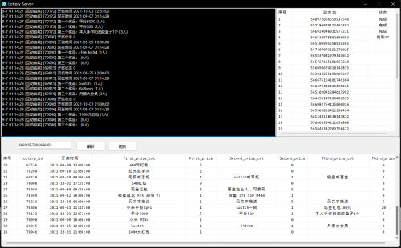

  
易语言做的一个哔哩哔哩动态抽奖爬虫
  

  
  

## 声明

- 写的很烂
- 需要用到精益模块（9.0.0）

### 一切开发旨在学习，请勿用于非法用途

- 完全免费且开放源代码，仅供学习研究使用

### 许可证

采用 `MIT License` 协议开源。

鉴于项目的特殊性，可能在任何时间**停止更新**或**删除项目**。

**一切开发旨在学习，请勿用于非法用途**

## 赞助
- 爱发电：https://afdian.net/@Tonwed

